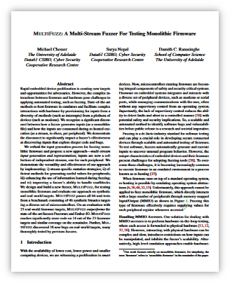

# MultiFuzz

Code release for [MultiFuzz: A Multi-Stream Fuzzer For Testing Monolithic Firmware](https://www.usenix.org/conference/usenixsecurity24/presentation/chesser).

</a>


## Quickstart

If you have yet to initialize the Ghidra submodule (required for the emulator) then this should be done before starting:

```
git submodule update --init ghidra
```

Next place the target firmware into its own folder (e.g. `./firmware`) and run the fuzzer:


```
cargo run --release -- ./firmware
```

The first time the fuzzer runs it will generate an initial config file (`config.yml`). Some targets may need manual modifications, e.g. to add missing MCU specific memory sections. Additionally, automatic config file generation is currently only supported for ELF binaries, to fuzz other targets, the appropriate file must be created manually. Alternatively, MultiFuzz is also compatible with the configuration files generated by [Fuzzware](https://github.com/fuzzware-fuzzer/fuzzware?tab=readme-ov-file#configuring-firmware-images-for-fuzzing) including any MMIO models.


## Configuration

The fuzzer can be configure using environment variables:

- `WORKDIR`: (default=`workdir`) Configures the directory the fuzzer uses to store information about the fuzzing session.
- `COVERAGE_MODE`: Controls the coverage instrumentation used for feedback by the fuzzer (if unspecified the default mode is `blocks`).
    - `blocks`: Store a bit whenever a block is hit.
    - `edges`: Store a bit whenever an edge is hit.
    - `blockcounts`: Increment a counter whenever a block is hit.
    - `edgecounts`: (AFL-style) Increment a counter whenever an edge is hit.
- `REPLAY`: Instead of running the fuzzer, execute the input specified by the
- `GEN_BLOCK_COVERAGE`: Replay all the inputs in `WORKDIR/queue` with additional tracing enabled to produce a json file containing information about the blocks discovered during the fuzzing campaign.
    - `full`: Output the newly discovered found by each input.
    - `blocks`: Output just the unique blocks found and the time and input the block was found at.
- `ANALYZE_CRASHES`: Replay all inputs in `WORKDIR/crashes` and print information about unknown crashes.

### Debugging options

- `GDB_BIND`: (only used when `REPLAY` is set) address to bind a gdb-stub instance to, waiting for `gdb` to connect for debugging.
- `PRINT_HOOK`: Allows a hook to be injected at a symbol to print the output of string buffer.
  - One register form (e.g. `PRINT_HOOK='putc(r0:char)`, `PRINT_HOOK='puts(r0:str)`): argument is treated as a character or null terminated string.
  - Two register form (e.g. `PRINT_HOOK='stdio_write(r0,r1)`): first argument is treated as a pointer, the second argument is treated as length.

## License

MultiFuzz is dual-licensed under either:

* MIT License ([LICENSE-MIT](./LICENSE-MIT))
* OR Apache License, Version 2.0 ([LICENSE-APACHE](./LICENSE-APACHE))


## Copyright

Copyright (c) Cyber Security Research Centre Limited 2024. This work has been supported by the Cyber Security Research Centre (CSCRC) Limited whose activities are partially funded by the Australian Government's Cooperative Research Centres Programme. We are currently tracking the impact CSCRC funded research. If you have used this code in your project, please contact us at contact@cybersecuritycrc.org.au to let us know.


**Cite as:**

```
@inproceedings{multifuzz2024,
  title     = {MultiFuzz: A Multi-Stream Fuzzer For Testing Monolithic Firmware},
  author    = {Chesser, Michael and Nepal, Surya and Ranasinghe, Damith C},
  booktitle = {{USENIX} Security Symposium},
  series    = {USENIX Security},
  year      = {2024}
}
```
